# Milestones

The capstone is built incrementally across the programme, then finalised in the last two weeks. This page gives the structure; exact calendar dates are confirmed separately.

!!! warning "Dates not yet confirmed"
    `[MILESTONE DATES TO BE ADDED]`. Confirm actual dates with your course team and treat the structure below as the sequence, not the schedule.

## Milestone overview

```mermaid
gantt
    dateFormat  X
    axisFormat  %s
    section Frame
    Milestone 1 - Frame          :m1, 0, 1
    section Understand
    Milestone 2 - Understand     :m2, after m1, 1
    section Model
    Milestone 3 - Model          :m3, after m2, 1
    section Build
    Milestone 4 - Build          :m4, after m3, 1
    section Tell
    Final 2 weeks - Tell the story :m5, after m4, 1
```

*(Illustrative sequence only - not to calendar scale. See [Open Items](../open-items.md) for actual dates.)*

## Milestone 1 - Frame

- Business problem confirmed
- Stakeholder and decision identified
- Data source identified and access requested (see [Data](data.md) - this is a hard dependency for Milestone 2, so start it now)
- Driver tree and/or hypothesis tree built
- Opportunity sized (with assumptions documented)

**Guide pages:** [Frame the Problem](../project-guide/1-business-opps/02-business-problem.md), [Size the Opportunity](../project-guide/1-business-opps/04-size-the-opportunity.md)

## Milestone 2 - Understand

- Data inventory completed
- Data quality assessed and documented
- Structured EDA completed
- Initial findings and follow-up hypotheses documented

**Guide pages:** [Understand the Data](../project-guide/2-data-exploration/01-collect-the-data.md), [Assess Data Quality](../project-guide/2-data-exploration/02-assess-data-quality.md), [Explore the Data](../project-guide/2-data-exploration/03-explore-the-data.md)

## Milestone 3 - Model

- Problem formulation justified
- Baseline established
- Model(s) developed and validated
- Business impact quantified

**Guide pages:** [Build the Model](../project-guide/3-modeling/01-build-the-model.md), [Quantify Business Impact](../project-guide/4-dashboards/02-quantify-business-impact.md)

## Milestone 4 - Build the solution

- Engineering practices applied (modularity, reproducibility, logging)
- Power BI dashboard built
- Sustainability assessed
- GenAI assessment completed

**Guide pages:** [Build the MVP](../project-guide/5-production/01-build-the-mvp.md), [Consider Production Readiness](../project-guide/5-production/02-production-readiness.md), [Assess GenAI](../project-guide/5-production/03-assess-genai.md), [Assess Sustainability](../project-guide/6-business-impact/01-assess-sustainability.md), [Build the Power BI Dashboard](../project-guide/4-dashboards/01-power-bi-dashboard.md)

## Final 2 weeks - Tell the story

- Consolidate analysis into a single coherent narrative
- Finalise the model and its documented limitations
- Finalise the Power BI dashboard
- Build the storyboard
- Build and rehearse the final presentation
- Land on a clear recommendation and stakeholder ask

**Guide pages:** [Build the Story](../project-guide/6-business-impact/02-build-the-story.md)

!!! tip "The final two weeks are for polish, not discovery"
    If you're still forming your core findings or deciding your model approach in the final two weeks, you've started too late. Use that window to consolidate and communicate - not to do new analysis. See [Build the MVP](../project-guide/5-production/01-build-the-mvp.md) for why front-loading matters.
