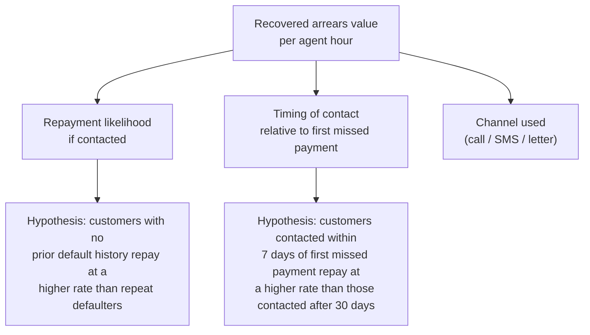

# Example Use Case Planning

!!! danger "100% fictional - not a template to copy"
    Everything on this page - the bank, the stakeholder, the data, the numbers - is **invented for illustration only**. It exists to show what a properly scoped use case and a properly documented dataset look like, end to end. Your actual capstone must use your own real, sourced data for a real problem within your own bank - see [Use Cases](use-cases.md) and [Data](../getting-started/data.md). Do not copy these figures, this dataset, or this framing into your own submission.

## Why this page exists

Two situations this is for:

- You want to see what "good" looks like at each stage before you commit to your own use case and start sourcing your own data.
- Your real data access is delayed and your team needs something to work with so you're not blocked - see [Data](../getting-started/data.md#if-you-dont-have-data-yet-or-want-to-see-the-method-applied-first).

## The fictional scenario

**Northfield Bank** (fictional) has seen a rise in early-stage mortgage arrears over the last two quarters. The Head of Collections doesn't have a reliable way to tell which overdue customers are worth prioritising for proactive contact, so effort is spread evenly across the book - including customers who were always going to self-cure, and customers who needed a call weeks ago.

This is the same scenario used as the worked example in [Frame the Problem](../project-guide/01-frame-the-problem.md) - read that page for how the framing below was derived.

### Framing

| Element | Content |
|---|---|
| Stakeholder | Head of Collections |
| Business decision | Which overdue customers to prioritise for proactive contact, given limited collections capacity |
| Problem statement | "We don't know which overdue customers are most likely to repay if contacted, so collections effort is spread evenly and may be missing the highest-value opportunities." |
| Desired outcome | A prioritised contact list that increases recovered value per collections agent hour |
| Constraint | Only ~40 agent-hours available per week across the team - capacity is fixed, so *prioritisation*, not volume, is the lever |

### Driver tree and hypotheses

### First-pass opportunity sizing

!!! example "Illustrative numbers only"
    - Overdue accounts per month: ~1,200 (fictional)
    - Average recoverable balance per account: £2,400 (fictional assumption, would need confirming with Finance)
    - Estimated uplift in recovery rate from better prioritisation: +5 percentage points (fictional assumption, sensitivity-tested at +2pp / +5pp / +9pp)
    - **Estimated opportunity:** roughly £58k–£260k per month depending on assumption, before accounting for the cost of running the model

See [Size the Opportunity](../project-guide/02-size-the-opportunity.md) for how to build and sensitivity-test a real version of this.

## The dummy dataset

A fictional extract from Northfield Bank's (imagined) collections system, at **one row per overdue account, per month**.

### Data dictionary

| Field | Type | Description |
|---|---|---|
| `account_id` | string | Unique account identifier |
| `customer_id` | string | Unique customer identifier (one customer can hold multiple accounts) |
| `product_type` | category | `mortgage` / `personal_loan` |
| `days_past_due` | integer | Days since the payment was due |
| `arrears_balance` | float | Amount currently overdue, in GBP |
| `original_loan_amount` | float | Original loan principal, in GBP |
| `customer_tenure_years` | float | Years the customer has held an account with the bank |
| `prior_default_flag` | boolean | Whether the customer has defaulted on any product before |
| `contact_attempts_last_30d` | integer | Number of contact attempts in the last 30 days |
| `last_contact_channel` | category | `call` / `sms` / `letter` / `none` |
| `income_band` | category | Self-reported income band at origination, banded (`A`–`E`) |
| `repaid_within_30d` | boolean | **Target variable** - did the customer repay the overdue amount within 30 days of first contact? |

### Illustrative sample rows

*(Fabricated for illustration - not statistically meaningful.)*

| account_id | days_past_due | arrears_balance | prior_default_flag | contact_attempts_last_30d | last_contact_channel | income_band | repaid_within_30d |
|---|---|---|---|---|---|---|---|
| ACC-00142 | 12 | 340.00 | false | 1 | call | C | true |
| ACC-00891 | 45 | 1,120.50 | true | 4 | letter | B | false |
| ACC-01033 | 6 | 95.20 | false | 0 | none | D | true |
| ACC-01560 | 88 | 2,430.00 | true | 6 | call | A | false |
| ACC-01721 | 21 | 410.75 | false | 2 | sms | *(missing)* | true |

### Realistic imperfections baked into the example

Consistent with what you should expect from your own real data (see [Data](../getting-started/data.md)), this fictional dataset is deliberately messy:

- `income_band` has missing values, concentrated among customers who applied before a system migration (a **bias** risk if handled carelessly - see [Assess Data Quality](../project-guide/04-assess-data-quality.md)).
- `days_past_due` has a small number of implausible negative values (a data entry/export error).
- `last_contact_channel` uses `none` and blank/null inconsistently for "not yet contacted" depending on which source system the row came from.
- Class imbalance: `repaid_within_30d` skews toward `false` for `days_past_due > 60`, but the dataset is dominated by early-stage (low `days_past_due`) accounts - worth checking whether that reflects the real book or a sampling artefact.
- `contact_attempts_last_30d` is a plausible **leakage risk** if not handled carefully: a high count could reflect the collections team already having identified this account as high-priority through some other (undocumented) process - worth interrogating before using it as a feature. See [Assess Data Quality](../project-guide/04-assess-data-quality.md#target-leakage-a-specific-trap).

## How this maps to the full journey

This example only sketches the framing and the data - it deliberately stops short of a full EDA, model and dashboard, so it doesn't do your thinking for you. Use it as a reference point at each stage of the [Project Journey](project-journey.md):

| Stage | What the example shows |
|---|---|
| [Frame the Problem](../project-guide/01-frame-the-problem.md) | The stakeholder/decision/problem-statement table above, and the driver tree |
| [Size the Opportunity](../project-guide/02-size-the-opportunity.md) | The sensitivity-tested opportunity estimate above |
| [Understand the Data](../project-guide/03-understand-the-data.md) | The data dictionary above |
| [Assess Data Quality](../project-guide/04-assess-data-quality.md) | The "realistic imperfections" list above |
