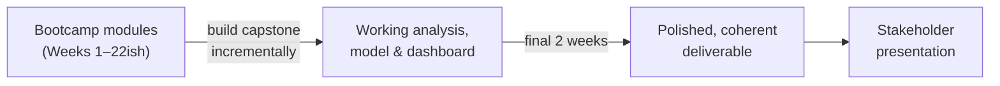

# Goal & Context

## The goal

For your capstone project, you are asked to investigate a business opportunity in your company, and prepare an analytical or modelled solution that can be acted upon. You will be required to come back with a clear recommendation, backed by a dashboard and a presentation we can use to make a decision.

The capstone gives you the opportunity to apply everything from your six-month journey - from framing a business problem through to a working analytical or modelled solution and a stakeholder-ready story - by solving a **business problem, end-to-end**.

## What does this project test?

This program will allow you to integrate all Data Bootcamp competencies to work end-to-end from an ABN AMRO business problem to solution. 

Specifically, the capstone tests whether you can:

- **Translate** a business problem and technical insights into actionable stakeholder recommendations
- **Evaluate** project feasibility by conducting ideation and business process mapping
- **Diagnose** data quality issues and **apply** appropriate techniques to prepare messy data for analysis
- **Design and construct** an analytical or modelled solution that produces actionable outputs 
- **Deliver** findings and recommendations through a professional stakeholder presentation

## How the project is built

The capstone is **built incrementally**, in parallel to your bootcamp modules. Ideally you will not leave the development until the end. Each stage of the [Project Journey](project-journey.md) corresponds to skills you develop as the programme progresses. As you complete a module, you can extend the capstone with the corresponding piece of work.

The **final two weeks** are reserve for you to **finalise** what you have into a polished deliverable: nsights and modeling analysis, a Power BI dashboard, and a stakeholder presentation that tells one clear, persuasive story.

!!! warning "Don't leave it to the end"
    Trainees who treat the capstone as a two-week sprint at the end of the bootcamp will produce weaker work than trainees who build it up stage by stage. See [Milestones](../getting-started/milestones.md) for the expected pacing.
