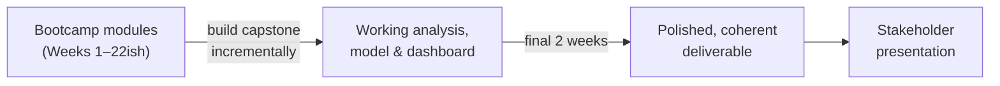

# Goal & Context

## The goal

The capstone gives you the opportunity to apply everything from your six-month journey - from framing a business problem through to a working analytical or modelled solution and a stakeholder-ready story - by solving a **realistic bank business problem, end-to-end**.

It is **one coherent project** that should read, from start to finish, as something an analytics team could realistically hand to a stakeholder.

## What does this project test?

Specifically, the capstone tests whether you can:

- Translate a vague business problem into a concrete, answerable question.
- Reason about whether a problem is even worth solving before you start solving it.
- Work with data that isn't perfectly clean, and know what to do about that.
- Build an analytical or modelled solution that is good enough to act on - and know how you know that.
- Explain your findings and your recommendation to someone who doesn't care how you built it, only what it means for the business.

## How the project is built

The capstone is **built incrementally**, in step with your bootcamp modules. Ideally you will not leave the development until the end. Each stage of the [Project Journey](project-journey.md) corresponds to skills you develop as the programme progresses. As you complete a module, you can extend the capstone with the corresponding piece of work.

The **final two weeks** are reserve for you to **finalise** what you have into a polished deliverable: a Power BI dashboard, insights and modeling analysis, and a stakeholder presentation that tells one clear, persuasive story.

!!! warning "Don't leave it to the end"
    Trainees who treat the capstone as a two-week sprint at the end of the bootcamp will produce weaker work than trainees who build it up stage by stage. See [Milestones](../getting-started/milestones.md) for the expected pacing.

## What this project is not

- It is **not** a data science tutorial with a single correct notebook to reproduce.
- It is **not** primarily a test of algorithm sophistication. A well-reasoned baseline explained clearly beats an unexplained "black box" model with a marginally better score.
- It is **not** a checklist exercise where you tick off stages without connecting them. Reviewers will look for how each stage **builds on** the one before it - see [What Success Looks Like](what-success-looks-like.md).
- It is **not** a fully deployed production system. See [Consider Production Readiness](../project-guide/09-production-readiness.md) for what level of engineering maturity is actually expected.

## Where to go next

- [What Success Looks Like](what-success-looks-like.md) - what a strong capstone actually demonstrates.
- [Use Cases](use-cases.md) - the banking business problems you can choose from.
- [Project Journey](project-journey.md) - the full end-to-end journey, visualised.
