# Project Journey

The capstone is one coherent, end-to-end project. Each stage below **builds on the output of the previous stage** - you cannot meaningfully skip one and expect the later stages to hold together. The [Project Guide](../project-guide/index.md) walks through each stage in detail.

## The full journey

```mermaid
flowchart TD
    A[Business problem] --> B[Stakeholder & decision]
    B --> C[Opportunity sizing]
    C --> D["Driver tree /\nhypothesis tree"]
    D --> E[Data understanding]
    E --> F[Data quality assessment]
    F --> G[Structured EDA]
    G --> H["New hypotheses &\nbusiness insights"]
    H --> I[Problem formulation]
    I --> J[Baseline]
    J --> K[Model development]
    K --> L[Model evaluation]
    L --> M[Business impact]
    M --> N["MVP / iterative\nimprovement"]
    N --> O["Production-readiness\nconsiderations"]
    O --> P[Sustainability]
    P --> Q["Power BI\ndashboard"]
    Q --> R[Storyboard]
    R --> S["Stakeholder\npresentation"]
    S --> T["Recommendation &\nnext steps"]

    classDef frame fill:#e0f0ff,stroke:#0a4a7a,color:#0a4a7a;
    classDef data fill:#e6f7e6,stroke:#1f6b1f,color:#1f6b1f;
    classDef model fill:#fff1cc,stroke:#7a5b00,color:#7a5b00;
    classDef build fill:#f3e6ff,stroke:#5a1f8a,color:#5a1f8a;
    classDef tell fill:#fde2e1,stroke:#8a1f1f,color:#8a1f1f;

    class A,B,C,D frame
    class E,F,G,H data
    class I,J,K,L,M model
    class N,O,P build
    class Q,R,S,T tell
```

## Reading the journey

The colours group the journey into five phases that map onto the [Milestones](../getting-started/milestones.md):

| Phase | Stages | In short |
|---|---|---|
| **Frame** | Business problem → Hypothesis tree | Understand what problem you're solving, for whom, and why it's worth solving. |
| **Understand** | Data understanding → New hypotheses | Understand what your data can and can't tell you, and where it points. |
| **Model** | Problem formulation → Business impact | Build a solution that answers the business question, and know how good it is. |
| **Build** | MVP → Sustainability | Turn the analysis into something usable, reproducible and honest about its limits. |
| **Tell** | Dashboard → Recommendation | Package everything into a persuasive, decision-focused story. |

!!! note "Each stage should reference what came before it"
    A common mistake is treating each stage as an isolated exercise. Your EDA findings should be traceable back to the hypotheses from your driver tree. Your model's evaluation metrics should be chosen because of the business impact stage that follows them, not chosen arbitrarily. Your final presentation should not contain a single insight that wasn't earned somewhere earlier in this journey.

## Where each stage is covered

Every stage in the diagram above has a dedicated page in the [Project Guide](../project-guide/index.md):

1. [Frame the Problem](../project-guide/01-frame-the-problem.md)
2. [Size the Opportunity](../project-guide/02-size-the-opportunity.md)
3. [Understand the Data](../project-guide/03-understand-the-data.md)
4. [Assess Data Quality](../project-guide/04-assess-data-quality.md)
5. [Explore the Data](../project-guide/05-explore-the-data.md)
6. [Build the Model](../project-guide/06-build-the-model.md)
7. [Quantify Business Impact](../project-guide/07-quantify-business-impact.md)
8. [Build the MVP](../project-guide/08-build-the-mvp.md)
9. [Consider Production Readiness](../project-guide/09-production-readiness.md)
10. [Assess GenAI](../project-guide/10-assess-genai.md)
11. [Assess Sustainability](../project-guide/11-assess-sustainability.md)
12. [Build the Power BI Dashboard](../project-guide/12-power-bi-dashboard.md)
13. [Build the Story](../project-guide/13-build-the-story.md)

Driver/hypothesis tree formation is covered inside stage 1; new hypotheses generated during EDA are covered inside stage 5.
