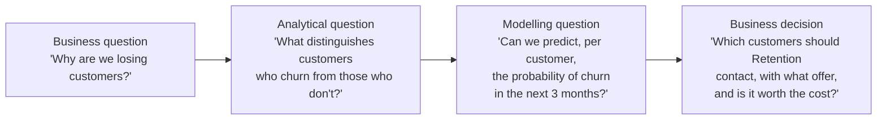
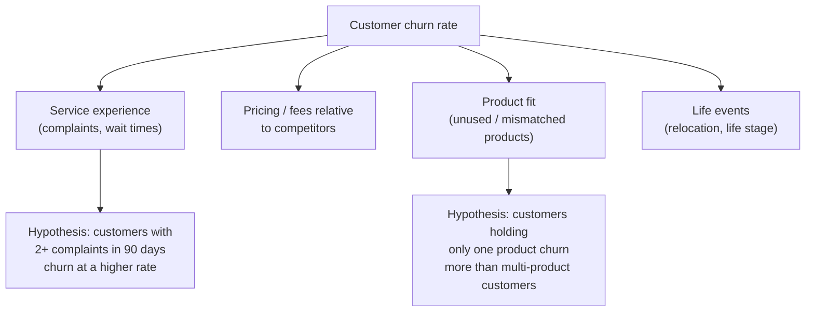

# 1. Frame the Problem

This is the foundation of the entire capstone. Get this stage wrong or rush it, and every later stage - the model, the dashboard, the presentation - will be solving the wrong problem well.

## Purpose

Before touching any data, your team must be able to explain, in plain language, what business problem you're solving, for whom, and what decision your work is meant to support.

## What you must define

**:material-alert-circle: Must** - before you move to [Size the Opportunity](02-size-the-opportunity.md), your team must have written down:

- **Business context** - what's happening in the bank that makes this problem relevant right now.
- **Stakeholder** - the specific role who owns the decision (e.g. "Head of Collections", not "the bank").
- **Business decision** - the actual decision this work should inform (e.g. "who to contact first," not "understand collections").
- **Problem statement** - one or two sentences connecting stakeholder, decision and desired outcome.
- **Desired outcome** - what changes if this project succeeds.
- **Constraints** - anything limiting the solution (time, data, regulatory, operational capacity).
- **Drivers** - the factors that plausibly influence the outcome, structured as a driver tree.
- **Hypotheses** - specific, testable statements about those drivers, defined **before** deep data exploration.
- **Opportunity size** - a first-pass estimate of the value at stake (see [Size the Opportunity](02-size-the-opportunity.md)).

**:material-alert: Should** - revisit and refine your problem statement after [Explore the Data](05-explore-the-data.md) if your early hypotheses turn out to be wrong. Framing is not a one-time exercise.

**:material-lightbulb-outline: Could** - validate your framing informally against a peer team before proceeding, to pressure-test whether the problem statement is genuinely decision-focused.

## From business question to business decision

A common failure mode is stopping at an analytical or modelling question and never connecting back to a decision. Keep translating until you reach an action someone will actually take:

!!! example "Worked example - churn"
    - **Business question:** "Why are we losing customers, and what should we do about it?"
    - **Analytical question:** "What distinguishes customers who churned in the last 12 months from those who didn't?"
    - **Modelling question:** "Can we predict, for each active customer, the probability they churn in the next 3 months?"
    - **Business decision:** "Which customers should the retention team proactively contact, with which offer, given a limited retention budget?"

    Notice the model doesn't answer the business question by itself - a probability of churn only becomes useful once it's connected back to a decision about who to contact and what it costs.

## Driver tree and hypothesis tree

A **driver tree** breaks your business outcome down into the factors that plausibly cause it, so you can investigate each piece rather than the vague whole.

A **hypothesis tree** takes each driver and turns it into a specific, testable statement - something you could, in principle, prove false with data.

!!! example "Testable vs. untestable hypotheses"
    - :x: "Customer experience matters for churn." *(too vague to test)*
    - :white_check_mark: "Customers who logged 2 or more complaints in the last 90 days churn at more than twice the rate of customers with none." *(specific, testable, falsifiable)*

## Define hypotheses before exploring the data in depth

**:material-alert-circle: Must** - write your initial hypotheses down before you start deep, exploratory analysis of the dataset. This is deliberate: hypothesis-first analysis keeps you focused on business-relevant questions instead of drifting through the data looking for anything interesting. You will refine and add hypotheses during [Explore the Data](05-explore-the-data.md) - that's expected and good. What's not acceptable is having no hypotheses at all before you start.

## Worked example, end to end

!!! example "Illustrative only - not a template to copy"
    - **Context:** The bank has seen a rise in early-stage mortgage arrears over the last two quarters.
    - **Stakeholder:** Head of Collections.
    - **Decision:** Which overdue customers to prioritise for proactive contact, given limited collections capacity.
    - **Problem statement:** "We don't know which overdue customers are most likely to repay if contacted, so collections effort is spread evenly and may be missing the highest-value opportunities."
    - **Desired outcome:** A prioritised contact list that increases recovered value per collections agent hour.
    - **Constraint:** Only `[X]` agent-hours available per week - capacity is fixed, so prioritisation (not volume) is the lever.
    - **Driver:** Repayment likelihood is plausibly driven by arrears severity, contact history, and account tenure.
    - **Hypothesis:** "Customers contacted within 7 days of first missed payment repay at a higher rate than those contacted after 30 days."
    - **Opportunity:** See [Size the Opportunity](02-size-the-opportunity.md).

## What this feeds into

Your problem statement, driver tree and hypotheses are inputs to **every** later stage - the EDA in [Explore the Data](05-explore-the-data.md) should test your hypotheses directly, and your model's evaluation metrics in [Build the Model](06-build-the-model.md) should be chosen because of the business decision defined here.

## Where to go next

- [Size the Opportunity](02-size-the-opportunity.md)
- Required deliverable checklist: [Required Deliverables - Business problem framing](../deliverables/required-deliverables.md#1-business-problem-framing)
