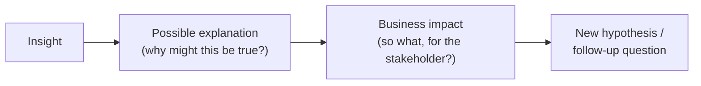

# 5. Explore the Data

## Purpose

Exploratory data analysis (EDA) is where you test your hypotheses from [Frame the Problem](01-frame-the-problem.md) against real data, and generate new, better-informed hypotheses. Done well, EDA is the bridge between a business question and a well-formulated modelling problem. Done badly, it's an unfocused tour of every chart your notebook can produce.

## EDA must be structured, not exploratory-in-name-only

**:material-alert-circle: Must** - your EDA should be:

- **Structured** - organised around your hypotheses and research questions, not a random walk through columns.
- **Systematic** - cover distributions, correlations, segmentation and outliers deliberately, not opportunistically.
- **Hypothesis-driven** - every major piece of analysis should trace back to a hypothesis from your driver tree, or generate a new one.
- **Iterative** - early findings should prompt follow-up questions, which you then go and answer.
- **Connected to business questions** - every finding should be interpretable in terms of the stakeholder's decision, not just statistically interesting.

## What to cover

**:material-alert-circle: Must** cover, for the variables relevant to your problem:

- **Distributions** - shape, skew, spread of key variables, including the target.
- **Correlations** - relationships between candidate features and the target, and between features themselves (relevant for later feature selection and multicollinearity awareness).
- **Segmentation** - how key metrics differ across meaningful groups (e.g. customer segment, product type, region).
- **Outlier analysis** - building on [Assess Data Quality](04-assess-data-quality.md), understand whether outliers are meaningful signal or noise.
- **Missingness** - patterns in what's missing, and whether missingness itself is informative.
- **Bias** - whether your sample or your findings might not generalise.
- **Inconsistencies** - anything uncovered in [Assess Data Quality](04-assess-data-quality.md) that affects interpretation.
- **Target behaviour** - how the target variable is distributed, and how it varies across the segments and drivers you hypothesised about.
- **Relationships between variables** - not just each variable in isolation.

## Translate a business question into research questions

**:material-alert-circle: Must** - before writing exploration code, translate your hypotheses into specific, answerable research questions and the variables needed to answer them.

!!! example "From hypothesis to research question"
    - **Hypothesis:** "Customers with 2+ complaints in 90 days churn at a higher rate."
    - **Research question:** "What is the churn rate for customers with 0, 1, and 2+ complaints in the trailing 90 days?"
    - **Variables needed:** complaint count (rolling 90-day window), churn flag.

## Python vs. SQL - justify your choice

**:material-alert-circle: Must** - explain, at least briefly, why you used Python or SQL for a given transformation or analysis step. You don't need a justification for every line of code - but you should be able to explain your general reasoning.

| Tends to favour SQL | Tends to favour Python |
|---|---|
| Aggregating/joining large tables before analysis | Statistical analysis, visualisation, iterative exploration |
| Simple, reusable data-quality checks | Anything requiring a modelling library |
| Filtering/reshaping close to the data source | Complex multi-step feature engineering |

This is a general pattern, not a rule - justify your actual choices rather than citing this table.

## Data-driven vs. assumption-based hypotheses

Be explicit about which kind of hypothesis you're working with:

- **Data-driven hypothesis** - generated *from* a pattern you observed in the data (e.g. "we noticed churn spikes right after a fee increase, which suggests price sensitivity").
- **Assumption-based hypothesis** - generated *before* looking at the data, from business reasoning or domain knowledge (e.g. "we expect complaint volume to predict churn, based on general banking experience").

**:material-alert-circle: Must** - label your hypotheses as one or the other. Data-driven hypotheses discovered during EDA still need to be tested with rigour - a pattern you happened to notice is not automatically real or causal.

## Turning insight into business value

**:material-alert-circle: Must** - for your key EDA findings, follow this chain explicitly:

!!! example "Applying the chain"
    - **Insight:** Customers who contact support 3+ times in a month churn at 4x the base rate.
    - **Possible explanation:** Repeated contact likely signals an unresolved problem, not just engagement.
    - **Business impact:** If confirmed, a "3rd contact in 30 days" trigger could route customers to a retention specialist before they leave - a concrete, actionable intervention.
    - **New hypothesis:** Does the *reason* for contact matter more than the *count* - are complaint-related contacts more predictive than routine queries?

Findings that stop at "insight" without reaching "business impact" are not yet finished.

## Critical reflection

**:material-alert-circle: Must** - for your key findings, explicitly consider:

- **What could be biased?** - e.g. does your sample over-represent a particular segment, time period, or channel?
- **What is unknown?** - what would you need that you don't have, to be more confident?
- **What might be misinterpreted?** - could a stakeholder draw a stronger conclusion than your evidence supports?
- **What additional data would help?** - be specific, not "more data would help."

This reflection should appear in your documentation, not just in your head - see [Required Deliverables](../deliverables/required-deliverables.md#4-exploratory-data-analysis).

## The role of EDA in what comes next

EDA is not a standalone deliverable - it directly shapes:

- **[Build the Model](06-build-the-model.md)** - your EDA findings inform feature selection, problem formulation, and what "good" performance would even mean.
- **[Build the Story](13-build-the-story.md)** - your strongest, most business-relevant EDA findings often belong in the final presentation, even if no model ever uses them directly.

## Where to go next

- [Build the Model](06-build-the-model.md)
- Required deliverable checklist: [Required Deliverables - Exploratory Data Analysis](../deliverables/required-deliverables.md#4-exploratory-data-analysis)
