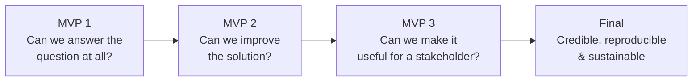

# 8. Build the MVP

## Purpose

Avoid the single most common failure mode in analytics projects: spending most of your time perfecting a model before confirming the business problem and data actually support the approach. MVP thinking forces you to prove the concept works, cheaply, before investing in polish.

## The expected progression

**:material-alert-circle: Must** - be able to show evidence of this progression, even informally (e.g. in a short changelog or notebook history), not just a single final version:

### MVP 1 - Can we answer the business question at all?

The simplest possible version: a baseline model or even a manual rule, built on a first-pass understanding of the data. The goal is to prove the business question is *answerable* with this data - not to get a good score.

### MVP 2 - Can we improve the analytical/modelled solution?

Iterate on MVP 1 with better features, better validation, or a more suitable model - now that you know the approach is viable, invest in making it good.

### MVP 3 - Can we make the solution useful for a stakeholder?

Translate MVP 2's output into something a stakeholder could actually act on - thresholds set with business logic, output connected to a decision, business impact quantified (see [Quantify Business Impact](07-quantify-business-impact.md)).

### Final - Can we demonstrate a credible, reproducible and sustainable solution?

Consolidate: documented limitations, reproducible code, sustainability considered (see [Consider Production Readiness](09-production-readiness.md) and [Assess Sustainability](11-assess-sustainability.md)), and a polished story (see [Build the Story](13-build-the-story.md)).

## Why this order matters

!!! warning "Don't perfect a model built on the wrong foundation"
    If your team spends two weeks tuning a model before checking whether the target variable is even well-defined, or whether the data supports the hypothesis at all, that time is largely wasted - you'll likely need to redo the modelling once the foundational issue surfaces. MVP 1 exists specifically to surface foundational problems early, while they're still cheap to fix.

## What "good" looks like at each stage

**:material-alert-circle: Must**

- Show that you validated the *approach* (MVP 1) before investing heavily in improving it (MVP 2).
- Be able to explain what changed between each MVP stage and why.

**:material-alert: Should**

- Keep a lightweight record of this progression - a short section in your documentation or a few tagged notebook versions is enough; this doesn't need to be formal project management.

**:material-lightbulb-outline: Could**

- Frame your MVP progression using conceptual version control (see [Consider Production Readiness](09-production-readiness.md)) - e.g. a commit history that shows the iteration.

## What this feeds into

Your MVP progression is part of your evidence for reproducibility and iterative thinking, both required in [Technical Documentation](../deliverables/technical-documentation.md), and directly supports the [Definition of Done](../deliverables/definition-of-done.md) question: "does our solution work, and how do we know?"

## Where to go next

- [Consider Production Readiness](09-production-readiness.md)
