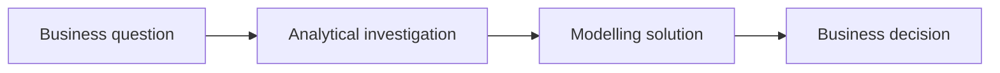

# Business Problem Definition

## Purpose

This is where your opportunity from [Stakeholder In-take](01-stakeholder-intake.md) becomes a concrete, decision-focused problem statement. It is worth spending time here as every later stage - the model, the dashboard, the presentation - will be building on top of this.

## What you must define

**:material-alert-circle: Must** - before you move on to [Hypotheses and Drivers](03-hypotheses.md), your team must have written down:

- **Business context** - what's happening in the bank that makes this problem relevant right now.
- **Business decision** - the actual decision this work should inform (e.g. "who to contact first," not "understand collections").
- **Problem statement** - one or two sentences connecting stakeholder, decision and desired outcome.
- **Desired outcome** - what changes if this project succeeds.
- **Constraints** - anything limiting the solution (time, data, regulatory, operational capacity).

**:material-alert: Should**

- Revisit and refine your problem statement after [Explore the Data](../2-data-exploration/03-explore-the-data.md) if your early hypotheses turn out to be wrong. Framing is not a one-time exercise.

## From business question to business decision

A common failure mode is stopping at an analytical or modelling question and never connecting back to a decision. Keep translating until you reach an action someone will actually take:

!!! example "Worked example - churn"
    - **Business question:** "Why are we losing customers, and what should we do about it?"
    - **Analytical question:** "What distinguishes customers who churned in the last 12 months from those who didn't?"
    - **Modelling question:** "Can we predict, for each active customer, the probability they churn in the next 3 months?"
    - **Business decision:** "Which customers should the retention team proactively contact, with which offer, given a limited retention budget?"

    Notice the model doesn't answer the business question by itself - a probability of churn only becomes useful once it's connected back to a decision about who to contact and what it costs.

## Worked example, end to end

!!! example "Illustrative only"
    - **Context:** The bank has seen a rise in early-stage mortgage arrears over the last two quarters.
    - **Stakeholder:** Head of Collections (identified during [Stakeholder In-take](01-stakeholder-intake.md)).
    - **Decision:** Which overdue customers to prioritise for proactive contact, given limited collections capacity.
    - **Problem statement:** "We don't know which overdue customers are most likely to repay if contacted, so collections effort is spread evenly and may be missing the highest-value opportunities."
    - **Desired outcome:** A prioritised contact list that increases recovered value per collections agent hour.
    - **Constraint:** Only `[X]` agent-hours available per week - capacity is fixed, so prioritisation (not volume) is the lever.

    See the full version of this example, including drivers, hypotheses and a dummy dataset, at [Example Use Case](../../overview/example-use-case.md).

## What this feeds into

Your problem statement and constraints are the direct input to [Hypotheses and Drivers](03-hypotheses.md), where you break this problem down into the factors that plausibly cause it, and turn those into testable hypotheses.

## Where to go next

- [Hypotheses and Drivers](03-hypotheses.md)
