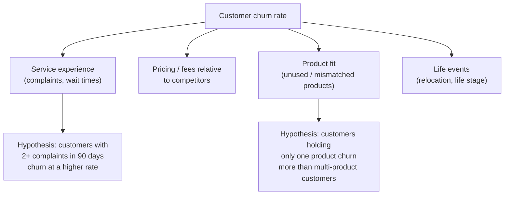

# Hypotheses and Drivers

## Purpose

Once your problem is stated (see [Business Problem Definition](02-business-problem.md)), break it down into the factors that plausibly cause it, and turn those into specific, testable hypotheses **before** you go deep into the data. This keeps your analysis focused on business-relevant questions instead of drifting through the data looking for anything interesting.

## What you must do

**:material-alert-circle: Must**

- Build a **driver tree** breaking your business outcome down into the factors that plausibly influence it.
- Turn at least your top few drivers into a **hypothesis tree**: specific, testable statements about those drivers.
- Write your initial hypotheses down **before** you start deep, exploratory analysis of the dataset.

**:material-alert: Should**

- Design a clear hypothesis for each opportunity you're seriously considering, not just your final choice as it helps you compare them on more than gut feel.

## Driver tree and hypothesis tree

A **driver tree** breaks your business outcome down into the factors that plausibly cause it, so you can investigate each piece rather than the vague whole.

A **hypothesis tree** takes each driver and turns it into a specific, testable statement that you could, in principle, prove false with data.

!!! example "Testable vs. untestable hypotheses"
    - :x: "Customer experience matters for churn." *(too vague to test)*
    - :white_check_mark: "Customers who logged 2 or more complaints in the last 90 days churn at more than twice the rate of customers with none." *(specific, testable, falsifiable)*

## Define hypotheses before exploring the data in depth

**:material-alert-circle: Must** - write your initial hypotheses down before you start deep, exploratory analysis of the dataset. This is deliberate: hypothesis-first analysis keeps you focused on business-relevant questions instead of drifting through the data looking for anything interesting. You will refine and add hypotheses during [Explore the Data](../2-data-exploration/03-explore-the-data.md) - that's expected and good. What's not acceptable is having no hypotheses at all before you start.

## Worked example

!!! example "Illustrative only - not a template to copy"
    - **Driver:** Repayment likelihood is plausibly driven by arrears severity, contact history, and account tenure.
    - **Hypothesis:** "Customers contacted within 7 days of first missed payment repay at a higher rate than those contacted after 30 days."

    See the full version of this example, including the driver tree diagram and opportunity sizing, at [Example Use Case](../../overview/example-use-case.md).

## What this feeds into

Your driver tree and hypotheses are inputs to **every** later stage:

- the opportunity sizing in [Size the Opportunity](04-size-the-opportunity.md) should reflect the drivers you've identified
- the EDA in [Explore the Data](../2-data-exploration/03-explore-the-data.md) should test your hypotheses directly
- your model's evaluation metrics in [Evaluate the Model](../3-modeling/02-evaluate-the-model.md) should be chosen because of the business decision defined in [Business Problem Definition](02-business-problem.md).

## Where to go next

- [Size the Opportunity](04-size-the-opportunity.md)
