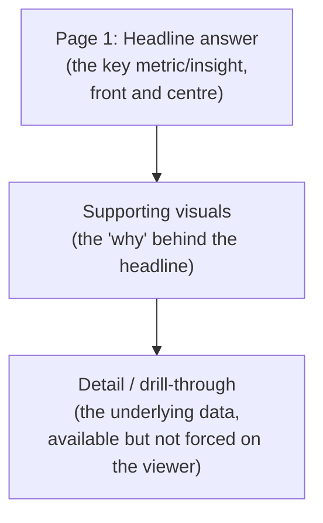

# 12. Build the Power BI Dashboard

## Purpose

The dashboard is not a data dump - it's a focused, structured tool for answering one clear business question and helping a stakeholder act on it. Build it the way you'd build the answer to a question you were asked, not a general-purpose data browser.

## What you must do

**:material-alert-circle: Must**

- Start from a **clear business question** - the same stakeholder and decision from [Frame the Problem](01-frame-the-problem.md), not a new one invented for the dashboard.
- Structure the dashboard using the **pyramid principle** (see [Build the Story](13-build-the-story.md)): the headline answer/insight should be immediately visible, with supporting detail available beneath it - not the other way round.
- Keep the design **simple and focused** - every visual should earn its place by supporting the business question. Cut anything that doesn't.
- Use **appropriate visualisations** for each type of insight (e.g. trend over time → line chart; comparison across categories → bar chart; part-to-whole → limit to where it's genuinely useful).
- Provide enough **context** for each visual that it's not misleading on its own (axis labels, time period, filters applied).
- Implement **at least one advanced Power BI feature**:
    - Drill-down
    - Drill-through
    - Filters (interactive slicers connected meaningfully to your visuals)
    - A basic data model (multiple related tables, not a single flat export)

**:material-alert: Should**

- Sanity-check each visual: is it actually correct, and is the context complete enough that it couldn't be misread?
- Design the dashboard to **tell a story**, guiding the viewer from headline to detail, not just present disconnected charts.

**:material-lightbulb-outline: Could**

- Add more than one advanced feature if it genuinely adds clarity (not just complexity).
- Add bookmarks or a simple navigation flow between dashboard pages.

## When is Power BI the right tool - and when isn't it?

**:material-alert-circle: Must** - briefly justify why Power BI is (or isn't, for parts of your output) the right medium for this particular insight.

| Power BI tends to be a good fit when... | Another approach may be better when... |
|---|---|
| The audience needs to explore/filter data themselves, repeatedly, over time | The insight is a one-off finding better delivered as a narrative slide |
| The insight is best shown through interactive, structured visuals | The result is a single number or short written recommendation |
| The dashboard will be revisited regularly for monitoring | The audience needs a persuasive story with a specific ask (see [Build the Story](13-build-the-story.md)) |

Dashboards and presentations serve different purposes - a good project usually needs both, not a dashboard trying to do a presentation's job.

## Dashboards in a banking context

Dashboards play a role in ongoing reporting, decision-making, and - in many banking contexts - regulatory or audit purposes, where a documented, repeatable view of key metrics matters as much as any single insight.

!!! info "Organisation-specific guidance"
    `[ORGANISATION-SPECIFIC POWER BI GUIDANCE TO BE ADDED]`

    Where specific conventions apply for how dashboards should be built or used in your organisation, they will be provided separately - do not assume undocumented conventions.

## A simple pyramid structure for your dashboard

## What this feeds into

Your dashboard is one of the required deliverables (see [Required Deliverables](../deliverables/required-deliverables.md#10-power-bi-dashboard)) and is often the artefact your stakeholder will keep using after the [final presentation](13-build-the-story.md) - build it to stand on its own.

## Where to go next

- [Build the Story](13-build-the-story.md)
