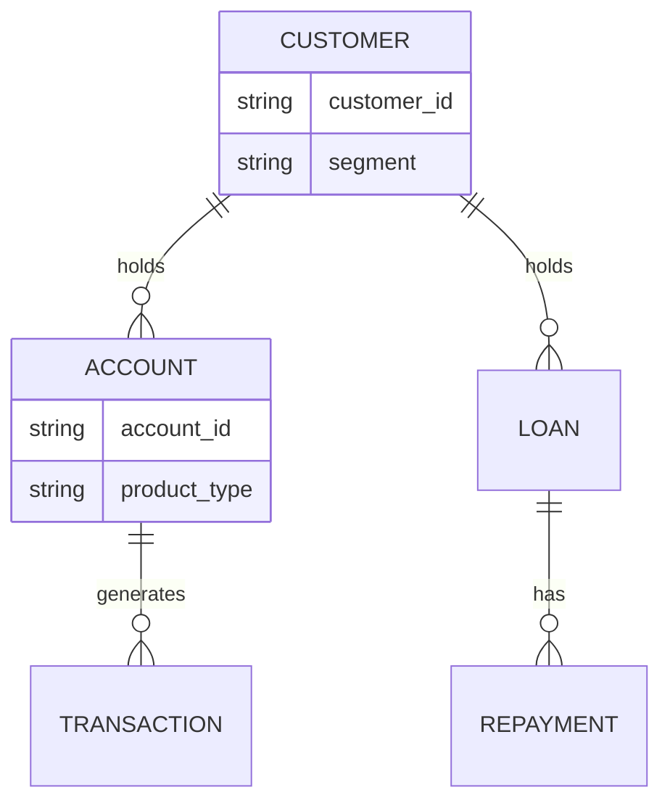

# Collect the Data

## Purpose

With your problem framed and your opportunity sized, this is where you actually go and get the data - see [Data](../../getting-started/data.md) for how to source it. Once you have an extract in hand, before you assess quality or explore patterns, you need to know what you actually have: what it represents, how the pieces relate, and where it comes from. Skipping this step leads to analysis built on misunderstood columns.

## What you must do

**:material-alert-circle: Must**

- Source your data by identifying the right owner/system and requesting access - see [Data](../../getting-started/data.md) for what this involves and the governance rules that apply.
- Discover where your data actually comes from and what it passes through before it reaches you (the **lineage**) - a field pulled straight from a source system behaves differently to one that's already been aggregated or transformed upstream.
- Build a **data inventory**: every table/file you've obtained, what it represents, its grain (what one row means), and roughly how many records/columns it has.
- Build a **data dictionary** (or annotate one, if provided) describing each field you intend to use: what it means, its type, and any known caveats.
- Identify how tables relate to each other (e.g. one customer to many accounts, one account to many transactions) - a simple entity relationship sketch is enough.
- Identify your **candidate target variable(s)** and confirm they exist and are usable for your use case.
- Make a concrete plan for your data analysis before you jump into code: what questions you're answering, in what order, and with what tools (see [Explore the Data](03-explore-the-data.md) for the Python-vs-SQL decision).

**:material-alert: Should**

- Note where field meaning is ambiguous or undocumented, and record it as an open question rather than guessing silently - go back to whoever owns the source system to confirm where you can.
- Cross-check a handful of records manually against your understanding of the field definitions - does the data actually behave the way the dictionary claims?

**:material-lightbulb-outline: Could**

- Produce a simple entity-relationship diagram if your dataset spans several related tables.

## Placeholders for dataset-specific detail

This site cannot tell you what's actually in your dataset - it depends on what you source. Use these placeholders in your own documentation until each is resolved, and replace them with real content once you've secured access and inspected the data:

- `[DATA SOURCE TO BE CONFIRMED]` - which system/team/extract this comes from
- `[DATA DICTIONARY TO BE ADDED]`
- `[TARGET VARIABLE TO BE CONFIRMED]`

See [Data](../../getting-started/data.md) for how to source your data, and the [Example Use Case](../../overview/example-use-case.md) for what a completed data dictionary looks like.

## A simple data inventory template

| Table / file | Grain (what is 1 row?) | Approx. size | Key fields | Relates to |
|---|---|---|---|---|
| `[table name]` | `[e.g. one row per customer]` | `[rows/cols]` | `[fields]` | `[related table via key]` |

## Sketching relationships

*(Illustrative structure only - replace with your actual dataset's entities and keys once confirmed.)*

## Why this stage matters

Modelling on a misunderstood column is one of the most common - and most avoidable - mistakes in analytics work. A field named `status` might mean account status, application status, or contact status depending on the table. Confirming meaning now prevents a wrong assumption from quietly propagating through [Assess Data Quality](02-assess-data-quality.md), [Explore the Data](03-explore-the-data.md) and [Build the Model](../3-modeling/01-build-the-model.md).

## What this feeds into

Your data inventory and dictionary are the foundation for [Assess Data Quality](02-assess-data-quality.md) - you can't assess whether a field's values are *wrong* until you know what "right" means.

## Where to go next

- [Assess Data Quality](02-assess-data-quality.md)
