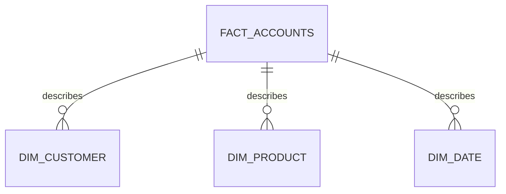
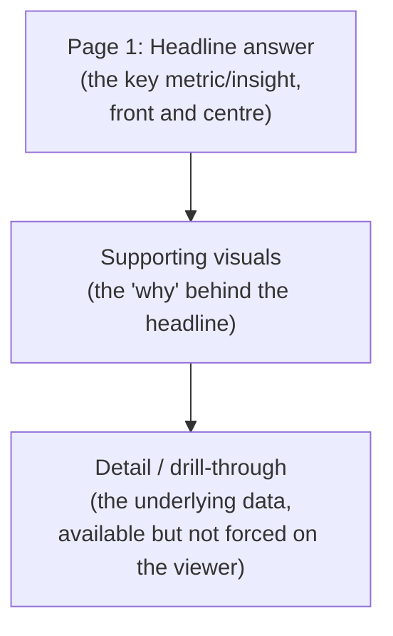

# Build the Power BI Dashboard

## Purpose

The dashboard is a focused, structured tool for allowing stakeholders to get answers to clear business questions so that they can act on it. Build it the way you'd build the answer to a question you were asked, not a general-purpose data browser.

## What you must do

**:material-alert-circle: Must**

- Start from a **clear business question** and know your **stakeholder** - the same stakeholder and decision from [Business Problem Definition](../1-business-opps/02-business-problem.md), not a new one invented for the dashboard.
- Determine the **key KPIs** that drive the decision.
- Structure the dashboard using the **pyramid principle** (see [Build the Story](../6-business-impact/02-build-the-story.md)): the headline answer/insight should be immediately visible, with supporting detail available beneath it.
- Decide deliberately which **chart type** best reflects each insight and don't default to the same chart for everything.
- Keep the design **simple and focused** where every visual earns its place by supporting the business question.
- Provide enough **context** for each visual that it's not misleading on its own (axis labels, time period, filters applied).
- Develop a **full dashboard with multiple, connected insights**, not a single isolated chart.
- Implement **at least one advanced Power BI feature**:
    - Drill-down
    - Drill-through
    - Filters (interactive slicers connected meaningfully to your visuals)
    - A basic data model (multiple related tables, not a single flat export)

**:material-alert: Should**

- Sanity-check each visual: is it actually correct, and is the context complete enough that it couldn't be misread?
- Design the dashboard to **tell a story**, guiding the viewer from headline to detail.
- Build your data model as a **star schema** (a central fact table - e.g. transactions or accounts - linked to supporting dimension tables like customer, product, date) rather than one flat table. This is what keeps a dashboard fast as data grows, and is standard practice for production Power BI work.
- Think about **access and roles**: if this dashboard held real sensitive data, who should be able to see which rows (e.g. row-level security by region or team)? You don't need to implement this, but you should be able to describe the plan.

**:material-lightbulb-outline: Could**

- Add more than one advanced feature if it genuinely adds clarity (not just complexity).
- Add bookmarks or a simple navigation flow between dashboard pages.

> ***Note** that you will not be assessed at a higher level just because you add more advanced features, but on how your dashboard answers key business questions and provides insight*

## Create specific visuals outside of Power BI

**:material-alert-circle: Must** - justify why Power BI is (or isn't, for parts of your output) the right medium for this particular insight.

| Power BI tends to be a good fit when... | Another approach may be better when... |
|---|---|
| The audience needs to explore/filter data themselves, repeatedly, over time | The insight is a one-off finding better delivered as a narrative slide |
| The insight is best shown through interactive, structured visuals | The result is a single number or short written recommendation |
| The dashboard will be revisited regularly for monitoring | The audience needs a persuasive story with a specific ask (see [Build the Story](../6-business-impact/02-build-the-story.md)) |

Dashboards and presentations serve different purposes so a good project usually needs both. The dashboard is not there to do a presentation's job.

## Dashboards in a banking context

Dashboards play a role in ongoing reporting, decision-making, and - in many banking contexts - regulatory or audit purposes, where a documented, repeatable view of key metrics matters as much as any single insight. Building "in line with your company's practices" (naming conventions, approved visuals, sign-off processes) is part of what makes a dashboard usable beyond your own laptop.

!!! info "Organisation-specific guidance"
    `[ORGANISATION-SPECIFIC POWER BI GUIDANCE TO BE ADDED]`

    Where specific conventions apply for how dashboards should be built or used in your organisation - naming, certified datasets, workspace/access structure - they will be provided separately. Ask your data platform team if you're unsure what's standard practice where you work.

## Star schemas and data modelling

A **star schema** puts one central fact table (the thing you're measuring - e.g. one row per transaction or per overdue account) at the middle, connected to smaller dimension tables that describe it (customer, product, date, channel). This is the standard, production-grade way to model data for Power BI because it keeps relationships simple and queries fast, even as the fact table grows.

**:material-alert: Should** - build towards this structure rather than a single wide, flat export, even if your dataset is small enough that it wouldn't strictly need it yet. It's a habit worth practising here.

## Roles and access

In a real deployment, not everyone who can see a dashboard should see all of its data - a regional manager might only need their own region's rows, for example. Power BI supports this through **row-level security (RLS)** and workspace-level access roles.

**:material-alert: Should** - describe, even briefly, who should be able to see what in your dashboard if it went live with real data, and what mechanism (RLS, separate workspaces, separate reports) would enforce that. You don't need to implement it for the capstone.

## A simple pyramid structure for your dashboard

## What this feeds into

Your dashboard is one of the required deliverables and is often the artefact your stakeholder will keep using after the [final presentation](../6-business-impact/02-build-the-story.md) - build it to stand on its own. It also feeds directly into [Quantify Business Impact](02-quantify-business-impact.md), where the headline numbers get translated into a fuller business case.

## Where to go next

- [Quantify Business Impact](02-quantify-business-impact.md)
