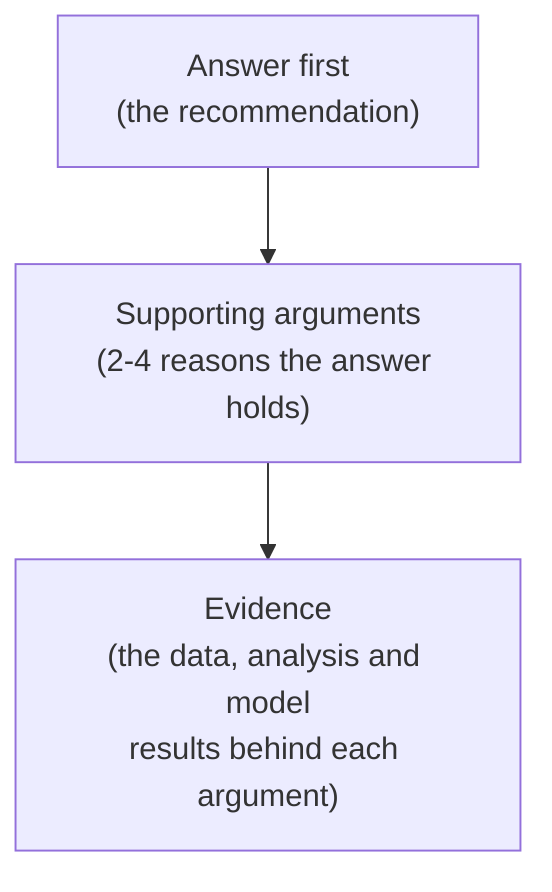

# Build the Story

## Purpose

Everything up to this point - framing, data, modelling, impact, engineering, dashboard - has to converge into one persuasive story that gets a stakeholder to a decision. This is the stage where a technically strong project either lands, or gets lost in translation.

!!! important "Not a walkthrough of everything you did"
    The final presentation is **not** a demonstration of everything you did. It is a **persuasive story about what the stakeholder should know and do.** A chronological tour of every notebook, chart and model iteration is the single most common way to lose a stakeholder audience - avoid it.

## The pyramid principle

Structure your communication **answer first**, then supporting arguments, then evidence - the reverse of how you probably did the work.

This feels backwards compared to how you built the project (data → analysis → model → conclusion), and that's exactly the point: **you built it bottom-up, but you present it top-down.**

## Build a storyboard before the deck

**:material-alert-circle: Must** - build a storyboard before building your final slides. A storyboard is a page-by-page (or slide-by-slide) skeleton of your narrative - headline message per page, and the one piece of evidence that supports it - built *before* you worry about layout, charts or design.

A simple storyboard format:

| Slide / page | Headline message (one sentence) | Supporting evidence |
|---|---|---|
| 1 | `[the recommendation, stated as a sentence, not a title]` | - |
| 2 | `[why this matters - the opportunity/risk at stake]` | `[opportunity sizing output]` |
| 3 | `[what the data/model shows]` | `[key EDA/model finding]` |
| ... | ... | ... |

**:material-alert-circle: Must** - every headline message should be a full sentence stating a conclusion (e.g. "Customers with 2+ complaints churn at more than double the base rate"), not a topic label (e.g. "Complaint analysis").

## What the final presentation must do

**:material-alert-circle: Must**

- **Lead with the message** - open with the recommendation, not the agenda.
- **Explain why it matters** - connect to the business context and opportunity size.
- **Present the evidence** - the minimum evidence needed to support the argument, not everything you produced.
- **Distinguish the best visual for the story** - pull the sharpest chart or dashboard view for each point, whether that's from Power BI or elsewhere, rather than reusing every chart you made.
- **Explain the model appropriately** - enough for the audience to trust it, without a full technical walkthrough (see below).
- **Quantify impact** - using the output of [Quantify Business Impact](../4-dashboards/02-quantify-business-impact.md).
- **Acknowledge limitations** - state what you're not confident about, plainly.
- **Document assumptions** - state the assumptions the recommendation depends on, clearly enough that a stakeholder could challenge them.
- **Make a recommendation** - a specific, actionable proposal, not a vague "the model shows promise."
- **Make a stakeholder ask** - what you specifically want the stakeholder to approve or decide.
- **Explain next steps** - what happens if the stakeholder says yes.

**:material-alert: Should**

- Rehearse the presentation as a team before delivering it, checking timing against `[PRESENTATION LENGTH TO BE CONFIRMED]`.
- Anticipate likely stakeholder questions (especially about limitations and risk) and prepare answers.
- Use influencing skills deliberately - framing, pacing, and anticipating objections - not just reading findings off a slide. The goal is to move the stakeholder to act, not just to inform them.

## Adapting for a mixed technical/non-technical audience

**:material-alert-circle: Must** - assume your audience includes both technical and non-technical stakeholders, and adapt accordingly:

- Lead every section with the **business meaning**, with technical detail available as backup (appendix slides, or "happy to go deeper" material) rather than presented by default.
- Explain the model conceptually (what it does, what it's based on, how confident it is) rather than mechanically (architecture, hyperparameters).
- Use consistent, plain-language framing for metrics - connect any number back to a business consequence (see [Quantify Business Impact](../4-dashboards/02-quantify-business-impact.md)).

## Worked example - recommendation and ask

!!! example "Illustrative structure only - figures are examples, not real requirements"
    "We recommend piloting the model with the highest-risk 15% of customers because this is expected to generate `[X benefit]` under our assumptions. We request approval for a 3-month pilot."

    This is an example of the *shape* a strong closing recommendation takes - specific action, specific scope, stated expected benefit, explicit ask. Do **not** treat the "15%" or "3-month pilot" figures as requirements for your own project; your numbers come from your own analysis.

## What this feeds into

This stage produces your final deliverable, and is the direct test of the [Definition of Done](../../final-presentation/definition-of-done.md).

## Where to go next

- [Definition of Done](../../final-presentation/definition-of-done.md) - confirm you can answer all the closing questions.
- [Capstone Checklist](../checklist.md) - final check before submission.
