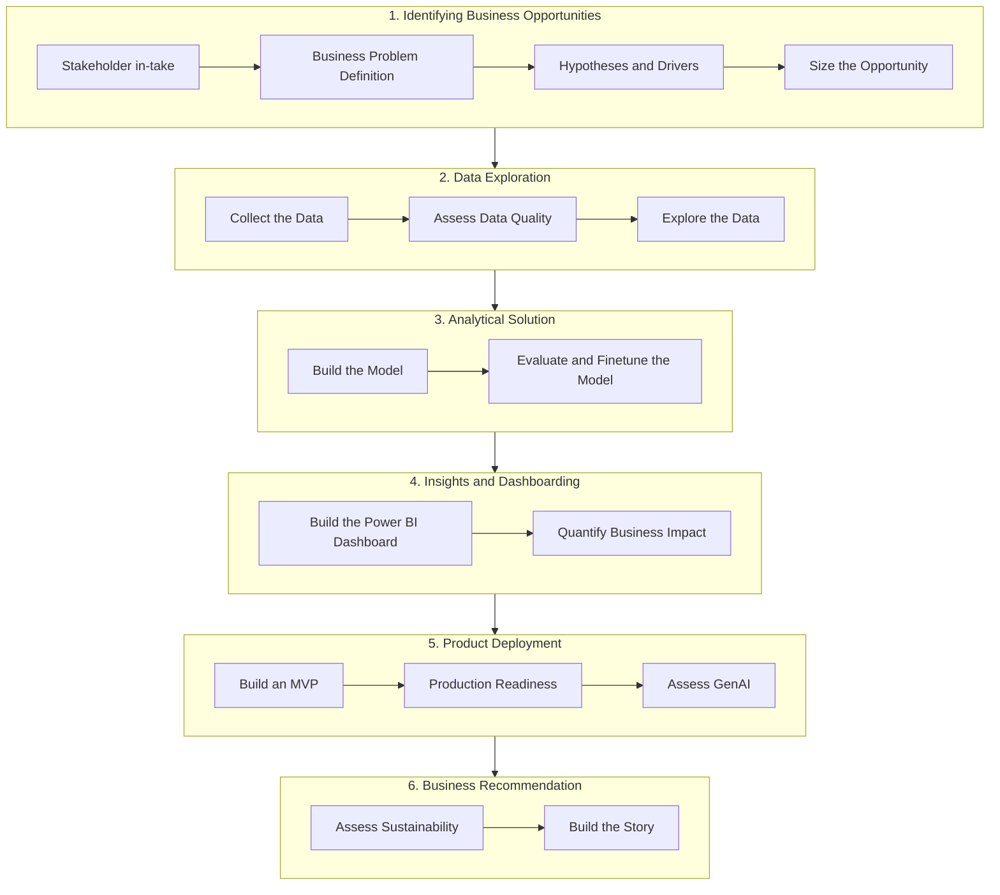

# Project Guide

This is the core of the capstone: 16 steps across 6 groups, from stakeholder in-take to the final stakeholder story. Each page follows the same structure - **purpose, what you must/should/could do, an example, and what it feeds into next.**

## How to read each stage

| Label | Meaning |
|---|---|
| **Must** | Required. Its absence is treated as an incomplete deliverable. |
| **Should** | Strongly expected. Deviating needs a clear, stated reason. |
| **Could** | Optional enhancement - only pursue once the musts and shoulds are solid. |

See [What Success Looks Like](../overview/what-success-looks-like.md) for more on this convention.

## The six groups, sixteen steps

## 1. Identifying Business Opportunities

1. [Stakeholder in-take](1-business-opps/01-stakeholder-intake.md)
2. [Business Problem Definition](1-business-opps/02-business-problem.md)
3. [Hypotheses and Drivers](1-business-opps/03-hypotheses.md)
4. [Size the Opportunity](1-business-opps/04-size-the-opportunity.md)

## 2. Data Exploration

1. [Collect the Data](2-data-exploration/01-collect-the-data.md)
2. [Assess Data Quality](2-data-exploration/02-assess-data-quality.md)
3. [Explore the Data](2-data-exploration/03-explore-the-data.md)

## 3. Analytical Solution

1. [Build the Model](3-modeling/01-build-the-model.md)
2. [Evaluate and Finetune the Model](3-modeling/02-evaluate-the-model.md)

## 4. Insights and Dashboarding

1. [Build the Power BI Dashboard](4-dashboards/01-power-bi-dashboard.md)
2. [Quantify Business Impact](4-dashboards/02-quantify-business-impact.md)

## 5. Product Deployment

1. [Build an MVP](5-production/01-build-the-mvp.md)
2. [Production Readiness](5-production/02-production-readiness.md)
3. [Assess GenAI](5-production/03-assess-genai.md)

## 6. Business Recommendation

1. [Assess Sustainability](6-business-impact/01-assess-sustainability.md)
2. [Build the Story](6-business-impact/02-build-the-story.md)

!!! note "This is not a recipe to follow blindly"
    Each page tells you what's expected and why - not a script to execute without thinking. The quality of your reasoning at each stage matters more than mechanically completing the step. See [What Success Looks Like](../overview/what-success-looks-like.md).

## Where this fits

See [Project Journey](../overview/project-journey.md) for how these steps map onto the full capstone journey, and [Milestones](../getting-started/milestones.md) for the expected pacing. See [Required Deliverables](../final-presentation/supporting-documentation.md) for what artefact each stage must produce.
