# Project Guide

This is the core of the capstone: a 13-stage walkthrough from business problem to stakeholder story. Each page follows the same structure - **purpose, what you must/should/could do, an example, and what it feeds into next.**

## How to read each stage

| Label | Meaning |
|---|---|
| **Must** | Required. Its absence is treated as an incomplete deliverable. |
| **Should** | Strongly expected. Deviating needs a clear, stated reason. |
| **Could** | Optional enhancement - only pursue once the musts and shoulds are solid. |

See [What Success Looks Like](../overview/what-success-looks-like.md) for more on this convention.

## The 13 stages

```mermaid
flowchart LR
    S1[1. Frame] --> S2[2. Size] --> S3[3. Understand data] --> S4[4. Data quality]
    S4 --> S5[5. Explore] --> S6[6. Model] --> S7[7. Business impact]
    S7 --> S8[8. MVP] --> S9[9. Production readiness] --> S10[10. GenAI]
    S10 --> S11[11. Sustainability] --> S12[12. Power BI] --> S13[13. Story]
```

1. [Frame the Problem](01-frame-the-problem.md)
2. [Size the Opportunity](02-size-the-opportunity.md)
3. [Understand the Data](03-understand-the-data.md)
4. [Assess Data Quality](04-assess-data-quality.md)
5. [Explore the Data](05-explore-the-data.md)
6. [Build the Model](06-build-the-model.md)
7. [Quantify Business Impact](07-quantify-business-impact.md)
8. [Build the MVP](08-build-the-mvp.md)
9. [Consider Production Readiness](09-production-readiness.md)
10. [Assess GenAI](10-assess-genai.md)
11. [Assess Sustainability](11-assess-sustainability.md)
12. [Build the Power BI Dashboard](12-power-bi-dashboard.md)
13. [Build the Story](13-build-the-story.md)

!!! note "This is not a recipe to follow blindly"
    Each page tells you what's expected and why - not a script to execute without thinking. The quality of your reasoning at each stage matters more than mechanically completing the step. See [What Success Looks Like](../overview/what-success-looks-like.md).

## Where this fits

See [Project Journey](../overview/project-journey.md) for how these 13 stages map onto the full 20-step journey and the four build [Milestones](../getting-started/milestones.md). See [Required Deliverables](../deliverables/required-deliverables.md) for what artefact each stage must produce.
